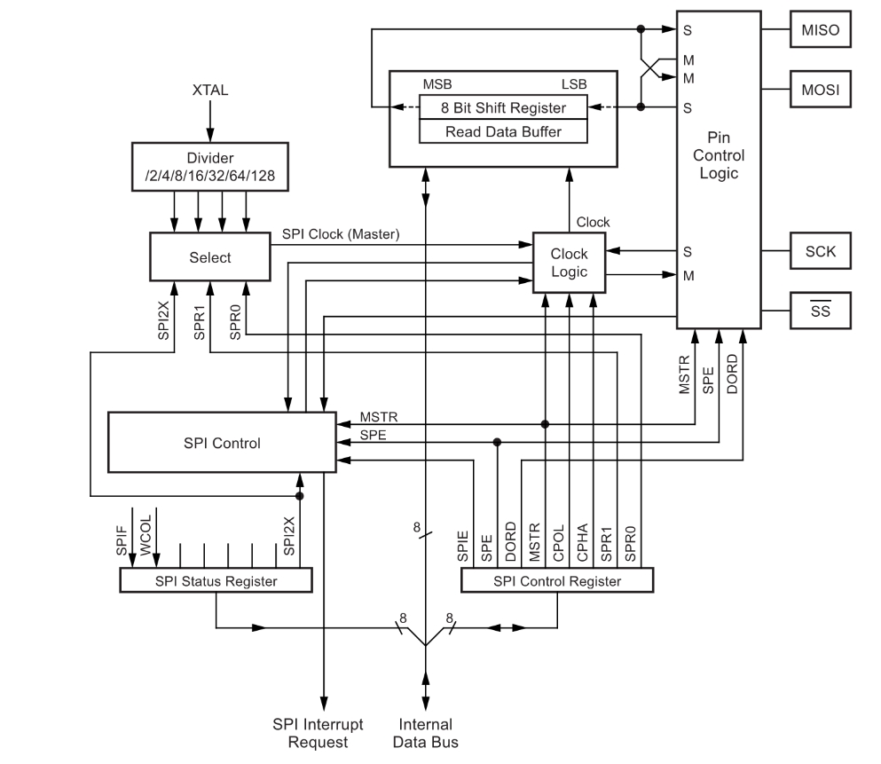
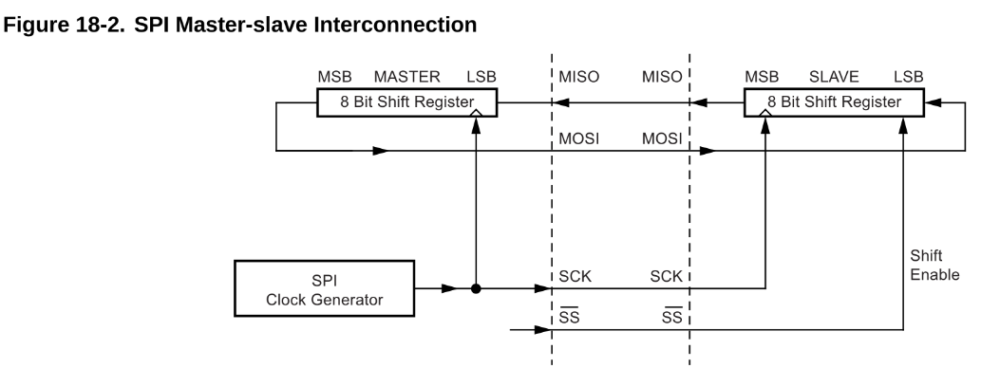
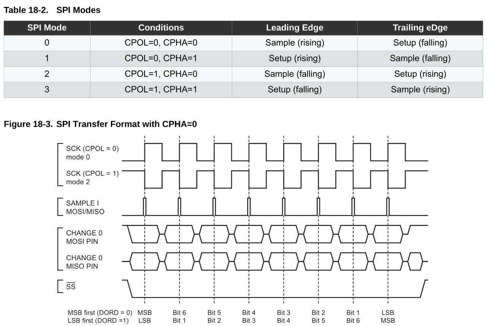
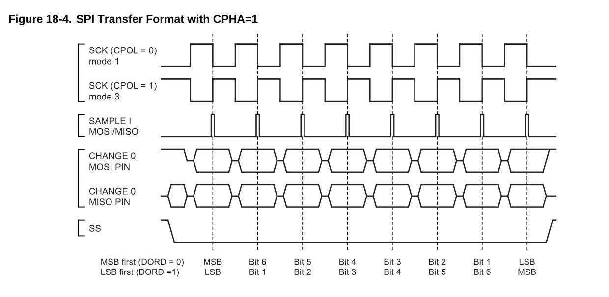

## SPI – Serial Peripheral Interface

- Full-duplex, three-wire **synchronous** data transfer
  - (MISO, MOSI, SCK, SS (Slave Select) )
- LSB first or MSB first data transfer
- Seven programmable bit rates 
  - clock através do sck
  - ***SPR1, SPR0***
- Apenas um 8 bit shift register 
  - compartilhado entre transmissor e receptor
  - transmite e pode receber simultaneamente, mas se for transmitido 2x em sequencia, perde o que foi recebido. (diferente do uart que possui 2 shift register independentes)
  
  

### Modos de SPI 

amostragem *(sample)* em *rising* ou amostragem *(sample)* em *falling* ***(CPOL: Clock Polarity & CPHA: Clock Phase)***

### Frame (memória flash spi)

CS          -> LOW (inicia setup spi)

SCK         -> 

SlaveInput  -> `Command Byte + Input Bytes (Address/Data/Dummy)`

SlaveOutput -> `Quick Status Byte + Dummy Output + Output Data Bytes`
