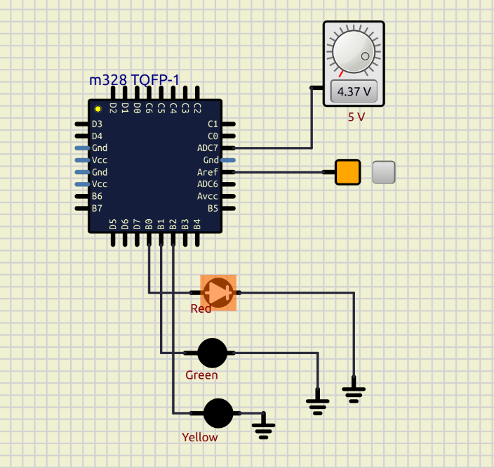

# Teoria ADC / DAC
> Eletrônica · Microcontroladores

---

## 1. Discretização

### Ruído e Truncamento

Ao amostrar um sinal analógico, a parte fracionária que não cabe na resolução é perdida — esse erro é o **ruído de discretização**.

| Amostra | Valor real  | Valor armazenado |
|---------|-------------|------------------|
| v(0)    | 3.05039348  | 3.05             |
| v(1)    | 2.8593821   | 2.85             |
| v(2)    | 1.859384    | 1.85             |
| v(n)    | 0.01xxxxx   | 0.01 *(truncado)* |

### Ponto Flutuante em Base 2

Representação binária com bits fracionários:

| Bit   | 2³ | 2² | 2¹ | 2⁰ | 2⁻¹ | 2⁻² | 2⁻³ | 2⁻⁴  |
|-------|----|----|----|----|-----|-----|-----|------|
| Valor | 8  | 4  | 2  | 1  | ½   | ¼   | ⅛   | 1/16 |
| Bits  | 0  | 1  | 0  | 1  | 1   | 0   | 1   | 0    |

0b 01011010 = 90 → 90 × 2⁻⁴ = **5,625**

---

## 2. ADC — Conversor Analógico-Digital

v(t) → \[A/D\] → v(n)

- **Vref** — tensão de referência, define o fundo de escala
- **CLK** — clock que determina a taxa de amostragem
- **Período de amostragem** — intervalo entre amostras, T = 1 / fs

---

## 3. DAC — Conversor Digital-Analógico

### Rede R-2R

- Resistores em duas denominações: **R** e **2R**
- Cada bit aciona uma chave (divisor de tensão chaveado)
- O AmpOp converte a corrente resultante em tensão de saída
- Cada bit contribui com peso proporcional a Vref / 2ⁿ

---

## 4. Conversão A/D Tipo SAR

O SAR (*Successive Approximation Register*) realiza uma **busca binária** para encontrar o código digital que melhor representa Vi.

**Fórmula:** n / 2ᴺ = Vi / Vref → n = (Vi / Vref) × 2ᴺ

**Exemplo:** Vi = 1,5 V · Vref = 5,0 V · N = 8 bits

n = (1,5 / 5,0) × 256 = 76,8 ≈ **77 ciclos**

Verificação: Vi = (5 × 76) / 256 ≈ **1,484 V**

### Busca Binária — Vi = 1,5 V, N = 8 bits

| Binário     | Decimal | Vx (V)      | Resultado |
|-------------|---------|-------------|-----------|
| 1000 0000   | 128     | 2,5000000   | ↑ acima   |
| 0100 0000   | 64      | 1,2500000   | ↓ abaixo  |
| 0110 0000   | 96      | 1,8750000   | ↑ acima   |
| 0101 0000   | 80      | 1,5625000   | ↑ acima   |
| 0100 1000   | 72      | 1,4062500   | ↓ abaixo  |
| 0100 1100   | 76      | 1,4843750   | ↓ abaixo  |
| 0100 1110   | 78      | 1,5234375   | ↑ acima   |
| 0100 1101   | 77      | 1,5039063   | ↑ acima   |

**Resultado:** n = 76 ou 77 — converge em exatamente **8 ciclos de clock** (um por bit).

---

## 5. Taxa de Amostragem e Ciclos de Conversão

O SAR usa 8 ciclos para a busca binária, mas o ADC precisa de ciclos extras para amostragem, hold e reset — totalizando **10 a 13 ciclos por conversão**.

No ATmega328p são **13 ciclos** por conversão (25 na primeira):

| Clock do ADC | Ciclos por conversão | Samples per Second |
|--------------|---------------------|--------------------|
| 1 MHz        | 13                  | ≈ 76.900 SPS       |
| 130 kHz      | 13                  | ≈ 10.000 SPS       |

> Para obter **10 kSPS** com clock do ADC em **1 MHz**, o prescaler deve ser configurado para dividir o clock do sistema adequadamente — menor frequência de ADC resulta em mais tempo de amostragem e maior precisão.

# ATmega328p — Analog-to-Digital Converter

## 1. Features

| Parâmetro                | Valor                                       |
|--------------------------|---------------------------------------------|
| Resolução                | 10 bits                                     |
| Precisão absoluta        | ± 2 LSB                                     |
| Tempo de conversão       | 65 – 260 µs                                 |
| Taxa máxima              | até 15 kSPS (*Critério de Nyquist*)          |
| Canais *single-ended*    | 6 multiplexados (+ 2 diferenciais)          |
| Tensão de entrada        | 0 a Vcc (5 V) ou referência interna 1,1 V   |

---

## 2. Registradores

### ADMUX — ADC Multiplexer Selection Register

| Bit       | 7     | 6     | 5     | 4   | 3     | 2     | 1     | 0     |
|-----------|-------|-------|-------|-----|-------|-------|-------|-------|
| **Label** | REFS1 | REFS0 | ADLAR | –   | MUX3  | MUX2  | MUX1  | MUX0  |

**REFS1:0 — Tensão de referência**

| REFS1 | REFS0 | Referência                          |
|-------|-------|-------------------------------------|
| 0     | 0     | AREF (pino externo)                 |
| 0     | 1     | AVcc (5 V, capacitor em AREF)       |
| 1     | 0     | Reservado                           |
| 1     | 1     | Referência interna 1,1 V            |

**ADLAR** — *Left Adjust Result*: alinhamento do resultado em ADCL/ADCH.

**MUX3:0 — Canal analógico**

| MUX3:0 | Canal         |
|--------|---------------|
| 0000   | ADC0 (PC0)    |
| 0001   | ADC1 (PC1)    |
| 0010   | ADC2 (PC2)    |
| 0011   | ADC3 (PC3)    |
| 0100   | ADC4 (PC4)    |
| 0101   | ADC5 (PC5)    |
| 0110   | ADC6 *        |
| 0111   | ADC7 *        |
| 1110   | 1,1 V (Vbg)   |
| 1111   | 0 V (GND)     |

> \* ADC6/ADC7: disponíveis apenas no encapsulamento TQFP/QFN (ausentes no DIP-28).

---

### ADCSRA — ADC Control and Status Register A

| Bit       | 7    | 6    | 5     | 4    | 3    | 2     | 1     | 0     |
|-----------|------|------|-------|------|------|-------|-------|-------|
| **Label** | ADEN | ADSC | ADATE | ADIF | ADIE | ADPS2 | ADPS1 | ADPS0 |

- **ADEN** — *ADC Enable*: liga/desliga o módulo ADC.
- **ADSC** — *ADC Start Conversion*: escreva `1` para iniciar conversão. Lê `1` enquanto a conversão ocorre.
- **ADATE** — *ADC Auto Trigger Enable*: disparo automático (fonte em ADTS2:0 do ADCSRB).
- **ADIF** — *ADC Interrupt Flag*: `1` ao fim da conversão. Limpo por hardware na ISR ou escrevendo `1` no bit.
- **ADIE** — *ADC Interrupt Enable*: interrupção ao término da conversão.
- **ADPS2:0 — Prescaler**

| ADPS2 | ADPS1 | ADPS0 | Divisor |
|-------|-------|-------|---------|
| 0     | 0     | 0     | 2       |
| 0     | 0     | 1     | 2       |
| 0     | 1     | 0     | 4       |
| 0     | 1     | 1     | 8       |
| 1     | 0     | 0     | 16      |
| 1     | 0     | 1     | 32      |
| 1     | 1     | 0     | 64      |
| 1     | 1     | 1     | 128     |

---

### ADCL / ADCH — ADC Data Register (16 bits, *read-only*)

| Bit       | 15    | 14    | 13    | 12    | 11    | 10    | 9     | 8     | 7     | 6     | 5     | 4     | 3     | 2     | 1    | 0    |
|-----------|-------|-------|-------|-------|-------|-------|-------|-------|-------|-------|-------|-------|-------|-------|------|------|
| **Label** | –     | –     | –     | –     | –     | –     | ADC9  | ADC8  | ADC7  | ADC6  | ADC5  | ADC4  | ADC3  | ADC2  | ADC1 | ADC0 |

> **ADLAR = 0** (default): 8 bits baixos em ADCL, 2 bits altos em ADCH.  
> **ADLAR = 1**: *left-adjusted* — 8 bits altos em ADCH, 2 bits baixos em ADCL.

---

### ADCSRB — ADC Control and Status Register B

| Bit       | 7   | 6    | 5   | 4   | 3   | 2     | 1     | 0     |
|-----------|-----|------|-----|-----|-----|-------|-------|-------|
| **Label** | –   | ACME | –   | –   | –   | ADTS2 | ADTS1 | ADTS0 |

**ADTS2:0 — Fonte de disparo automático (ADATE = 1)**

| ADTS2 | ADTS1 | ADTS0 | Fonte                          |
|-------|-------|-------|--------------------------------|
| 0     | 0     | 0     | *Free Running*                 |
| 0     | 0     | 1     | Analog Comparator              |
| 0     | 1     | 0     | INT0                           |
| 0     | 1     | 1     | Timer/Counter0 Compare Match A |
| 1     | 0     | 0     | Timer/Counter0 Overflow        |
| 1     | 0     | 1     | Timer/Counter1 Compare Match B |
| 1     | 1     | 0     | Timer/Counter1 Overflow        |
| 1     | 1     | 1     | Timer/Counter1 Capture Event   |

---

### DIDR0 — Digital Input Disable Register 0

| Bit       | 7   | 6   | 5     | 4     | 3     | 2     | 1     | 0     |
|-----------|-----|-----|-------|-------|-------|-------|-------|-------|
| **Label** | –   | –   | ADC5D | ADC4D | ADC3D | ADC2D | ADC1D | ADC0D |

> Escreva `1` no bit para desabilitar o buffer digital de entrada do pino correspondente, reduzindo consumo no modo analógico.

---